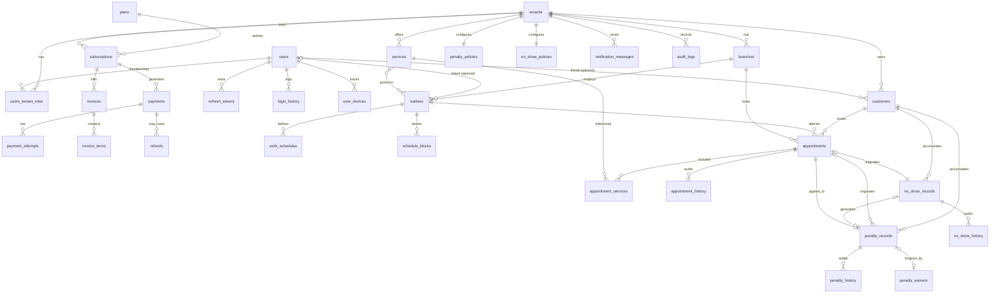

# 03 — Modelo de datos (diseño conceptual)

> Diseño conceptual. No se generan migraciones en Fase 0.

## 1. Convenciones

- **Nombres**: tablas y columnas en `snake_case`, en inglés, tablas en plural (`appointments`).
- **PK**: `id UUID` generado como **UUIDv7** (ordenable en el tiempo → índices B-tree sin fragmentación, a diferencia de UUIDv4).
- **Fechas**: siempre `timestamptz` (UTC en BD; la zona horaria es un atributo del tenant, default `America/Bogota`).
- **Dinero**: `numeric(12,2)` + columna `currency char(3)` (default `COP`). Nunca `float`.
- **Teléfonos**: E.164 (`+573001234567`).
- **Soft delete** en todas las entidades de negocio; los índices únicos usan filtro parcial `WHERE is_deleted = false`.
- **RLS** habilitado en toda tabla con `tenant_id` (ver [02-multi-tenant](02-multi-tenant.md)).

## 2. Base auditable

Toda entidad de negocio hereda conceptualmente de `BaseAuditableEntity`:

| Campo | Tipo | Nota |
|-------|------|------|
| `id` | uuid (v7) | PK |
| `tenant_id` | uuid | FK → `tenants`. Omitido solo en tablas globales de plataforma |
| `created_at` / `created_by` | timestamptz / uuid | poblados automáticamente por interceptor de EF |
| `updated_at` / `updated_by` | timestamptz / uuid | |
| `deleted_at` / `deleted_by` | timestamptz / uuid | |
| `is_deleted` | boolean | soft delete; filtro global de EF |
| `row_version` | bytea/xmin | concurrencia optimista |

## 3. Diagrama ER (principal)



## 4. Entidades por módulo

### Tenancy (plataforma)

- **`tenants`** — `name`, `slug` (único, citext — namespace de la URL pública `barberos.com/{slug}`, ver [ADR-008](adr/ADR-008-url-estrategia.md)), `custom_domain` (único, nullable — feature Premium/Enterprise futura), `legal_name`, `tax_id (NIT)`, `country` (ISO-3166, default `CO`), `timezone`, `currency`, `status` (Trial | Active | Suspended | Churned), `branding` (jsonb: logo_url, colores), `settings` (jsonb).
- **`branches`** — sucursales: `name`, `address`, `city`, `phone`, `geo (point, opcional)`, `is_main`.
- **`plans`** (global, sin tenant) — `code` (Inicio | Profesional | Premium | Enterprise), `price_monthly`, `currency`, `limits` (jsonb: max_barbers, max_branches, features[]). Los límites se evalúan en Application contra este jsonb → agregar features no requiere migración.

### Identity (plataforma)

- **`users`** (global) — `email` (citext único), `phone`, `password_hash` (Argon2id), `full_name`, `email_verified_at`, `status`, `failed_login_count`, `locked_until`.
- **`users_tenant_roles`** — membresía: `user_id`, `tenant_id`, `role` (Owner | Admin | Barber | Receptionist), único `(user_id, tenant_id, role)`. El rol **Customer no es membresía**: cualquier usuario autenticado puede reservar; el SuperAdmin es claim de plataforma en `users.platform_role`.
- **`refresh_tokens`** — `user_id`, `family_id`, `token_hash` (SHA-256, nunca el token plano), `expires_at`, `used_at`, `revoked_at`, `created_ip`, `device_id`. Rotación con detección de reutilización por familia (ver [05-seguridad](05-seguridad.md)).
- **`user_devices`** — `device_fingerprint`, `user_agent`, `last_seen_at`, `trusted`.
- **`login_history`** — `user_id`, `succeeded`, `ip`, `user_agent`, `failure_reason`, `created_at`. Tabla append-only.

### Catalog

- **`services`** — `name`, `description`, `duration_minutes`, `price`, `currency`, `category`, `is_active`, `sort_order`, `image_url`.
- **`barber_services`** — N:M barbero⇄servicio con `price_override` y `duration_override` opcionales.

### Scheduling

- **`barbers`** — perfil del barbero en el tenant: `branch_id`, `user_id` (nullable: un barbero puede existir sin cuenta), `display_name`, `photo_url`, `is_active`.
- **`work_schedules`** — horario semanal: `barber_id`, `weekday`, `start_time`, `end_time`, `valid_from`, `valid_to`. Permite versionar horarios sin perder historia.
- **`schedule_blocks`** — bloqueos puntuales: `barber_id`, `branch_id`, `range tstzrange`, `reason` (Vacation | Holiday | Personal | Maintenance). Festivos de Colombia se cargan como bloques a nivel de branch.

### Booking

> **Nota de negocio**: BarberOS no procesa pagos de servicios. Todos los precios de este módulo son **informativos** (lo que el barbero cobrará en persona); alimentan catálogo, reserva y métricas, jamás un checkout.

- **`appointments`** — `customer_id`, `barber_id`, `branch_id`, `time_range tstzrange`, `status` (Pending | Confirmed | Completed | Cancelled | NoShow), `base_price`, `penalty_amount` (default 0), `total_price` (= base + penalty, informativo), `currency`, `penalty_record_id` (nullable), `source` (Web | Panel | WhatsApp), `cancellation_reason`, `cancelled_at`, `idempotency_key`.
- **`appointment_services`** — snapshot por línea: `service_id`, `service_name`, `price`, `duration_minutes` (los precios históricos no cambian si el catálogo cambia).
- **`appointment_history`** — append-only: `appointment_id`, `action`, `old_data` (jsonb), `new_data` (jsonb), `actor_id`, `created_at`.

### Penalties (submódulo de Booking — ver [ADR-009](adr/ADR-009-penalizaciones.md))

- **`penalty_policies`** — una por tenant: `is_enabled`, `penalty_percentage` (0–100), `free_cancellation_window_hours` (default 24), `max_free_cancellations` (default 1), `evaluation_period_days` (default 30), `penalty_expiration_days` (nullable = no caduca). Configurable exclusivamente por la barbería; no existe política global.
- **`penalty_records`** — penalización de un cliente: `customer_id`, `origin_appointment_id` (la cita cancelada), `applied_appointment_id` (nullable — la reserva donde se consumió), `percentage` (snapshot de la política al momento), `status` (Active | Consumed | Waived | Expired), `expires_at`.
- **`penalty_history`** — append-only: `penalty_record_id`, `action` (Created | Consumed | Waived | Expired), `actor_id` (nullable si es del sistema), `details` (jsonb), `created_at`.
- **`penalty_waivers`** — perdón: `penalty_record_id` (único), `waived_by`, `reason` (obligatorio), `created_at`.

Flujo canónico: cliente cancela cita confirmada de $40.000 COP dentro de la ventana → `PenaltyRecord(percentage=50, status=Active)` → su siguiente reserva muestra y registra $60.000 ( `base_price=40000`, `penalty_amount=20000`) → al completarse, el record pasa a `Consumed`. Solo una penalización activa se consume por reserva (la más antigua primero).

### NoShow (submódulo de Booking — ver [ADR-012](adr/ADR-012-no-show.md))

- **`no_show_policies`** — una por tenant: `is_enabled`, `tolerance_minutes` (default 15), `max_no_shows` (default 1), `evaluation_period_days` (default 90), `penalty_increment_percentage` (default 25), `temporary_block_days` (default 0 = sin bloqueo), `permanent_block_threshold` (nullable = desactivado), `allow_manual_waiver` (default true).
- **`no_show_records`** — `customer_id`, `appointment_id` (único), `percentage_applied` (snapshot), `penalty_record_id` (nullable — el recargo generado), `status` (Active | Consumed | Waived | Expired), `recorded_by`.
- **`no_show_history`** — append-only: `no_show_record_id`, `action` (Created | Consumed | Waived | Expired | BlockApplied | BlockLifted), `actor_id`, `details` (jsonb), `created_at`.
- **`customers`** gana: `booking_blocked_until` (timestamptz nullable; valor lógico "infinito" = bloqueo permanente) y `booking_block_reason` — todo cambio de bloqueo queda trazado en `no_show_history`.

El recargo de no-show reutiliza la mecánica de `penalty_records` (porcentaje de cancelación + `penalty_increment_percentage`, un solo recargo combinado por reserva), calculado por un único servicio de dominio de cotización.

**Regla anti doble-reserva (a nivel de BD, no solo de aplicación):**

```
ALTER TABLE appointments ADD CONSTRAINT no_double_booking
  EXCLUDE USING gist (
    tenant_id WITH =,
    barber_id WITH =,
    time_range WITH &&
  ) WHERE (status IN ('Pending','Confirmed') AND is_deleted = false);
```

Requiere extensión `btree_gist`. Una condición de carrera entre dos requests concurrentes termina en violación de constraint → la API la traduce a `409 Conflict` con ProblemDetails. La validación de negocio en Application da el mensaje amable; el constraint garantiza la invariante.

### CRM

- **`customers`** — cliente **del tenant**: `user_id` (nullable — walk-ins sin cuenta), `full_name`, `phone`, `whatsapp_phone`, `email`, `notes`, `tags text[]`, `first_visit_at`, `last_visit_at`. Único parcial `(tenant_id, phone)`.
  - Decisión: el cliente de plataforma (`users`) y el cliente de barbería (`customers`) son entidades distintas enlazadas opcionalmente. Cada barbería es dueña de su cartera; un usuario puede ser customer en N barberías.

### Notifications

- **`notification_templates`** — `channel` (WhatsApp | Email | Sms), `event_type`, `language`, `body_template`, `provider_template_id` (las plantillas de WhatsApp Business requieren pre-aprobación de Meta).
- **`notification_messages`** — `channel`, `recipient`, `template_id`, `payload` (jsonb), `status` (Pending | Sent | Delivered | Failed), `provider_message_id`, `attempts`, `last_error`, `sent_at`.
- **`outbox_messages`** (plataforma) — `event_type`, `payload` (jsonb), `occurred_at`, `processed_at`, `attempts`, `next_retry_at`, `error`. Índice parcial sobre no-procesados.

### Billing

- **`subscriptions`** — `tenant_id`, `plan_id`, `status` (Trialing | Active | PastDue | Suspended | Cancelled), `current_period_start/end`, `cancel_at_period_end`, `trial_ends_at`.
- **`payments`** — `subscription_id`, `amount`, `currency`, `status`, `provider` (Wompi | MercadoPago | …), `provider_payment_id`, `paid_at`.
- **`payment_attempts`** — cada intento contra el proveedor: `payment_id`, `status`, `provider_response` (jsonb), `error_code`, `created_at`.
- **`invoices`** / **`invoice_items`** — numeración por tenant (`invoice_number` secuencial por tenant), `subtotal`, `tax` (IVA 19% configurable), `total`, `status`, `pdf_url`. Preparadas para facturación electrónica DIAN futura (`cufe`, `dian_status` nullable).
- **`refunds`** — `payment_id`, `amount`, `reason`, `provider_refund_id`, `status`.
- **`subscription_history`** / **`payment_history`** — append-only de cambios de estado.

### Audit (transversal)

- **`audit_logs`** — `tenant_id` (nullable para acciones de plataforma), `actor_id`, `action`, `entity_type`, `entity_id`, `old_values` (jsonb), `new_values` (jsonb), `ip`, `correlation_id`, `created_at`. Append-only; poblada por interceptor de EF sobre entidades marcadas como auditables.

## 5. Índices críticos

| Tabla | Índice | Propósito |
|-------|--------|-----------|
| appointments | `(tenant_id, barber_id, time_range)` GiST | disponibilidad y anti-solape |
| appointments | `(tenant_id, customer_id, created_at DESC)` | historial del cliente |
| appointments | `(tenant_id, branch_id, time_range)` | agenda por sucursal |
| customers | `(tenant_id, phone)` único parcial | dedupe + búsqueda |
| penalty_records | `(tenant_id, customer_id, status)` parcial `WHERE status = 'Active'` | lookup O(1) al cotizar una reserva |
| no_show_records | `(tenant_id, customer_id, created_at DESC)`; único `(appointment_id)` | conteo en período móvil; una falta por cita |
| refresh_tokens | `(token_hash)` único; `(family_id)` | validación O(1), revocación por familia |
| outbox_messages | parcial `WHERE processed_at IS NULL` | polling barato del worker |
| audit_logs | `(tenant_id, entity_type, entity_id, created_at DESC)` | trazabilidad |
| notification_messages | `(tenant_id, status, created_at)` | reintentos y monitoreo |

## 6. Estrategia de crecimiento

1. **0–1.000 tenants**: esquema plano + índices compuestos. Nada más.
2. **Tablas append-only grandes** (`audit_logs`, `login_history`, `appointment_history`, `notification_messages`): particionado **por rango mensual** cuando superen ~50M filas; las particiones viejas se archivan a storage frío y se desmontan.
3. **`appointments`**: candidata a particionado por rango de `time_range` (trimestral) solo a escala 10k tenants; el diseño con UUIDv7 + tstzrange lo permite sin cambios de modelo.
4. **Read replicas** para Metrics y reportes antes que sharding.
5. **Sharding por tenant** es la última carta y la ruta ya existe: connection factory tenant-aware (ver [11-escalabilidad](11-escalabilidad.md)).
